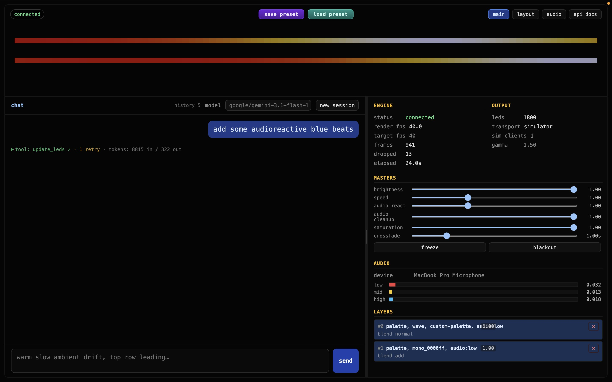

# ledctl — audio-reactive LED installation

test
# Wifi: WLED-AP
pw: wled1234


# Copy files to the Pi:
scp .env xander@100.121.105.103:/home/xander/audio_LED/Animated_LED


scp ~/.ssh/id_ed25519 xander@100.121.105.103:/home/xander/.ssh

-----

# SSH into the Pi from Mac:
ssh xander@XanderPi.local

# Fire up the server:
cd /home/xander/audio_LED/Animated_LED
.venv/bin/ledctl run --config config/config.pi.yaml

# Connect to Pi server UI:
http://100.121.105.103:8000/?password=kaailed


# Connect to Gledopto config:
ssh -L 8080:10.0.0.2:80 xander@XanderPi.local
http://localhost:8080




Python control layer for a 1800-LED festival install (4 × 450 WS2815 strips fed by a centre-mounted Gledopto / WLED via DDP). Mac-first dev with a browser simulator; same code ships to the Pi at the venue with a one-line config flip.

Design docs in repo root:
- `Hardware_setup.md` — hardware/electrical build (gear, power injection, waterproofing, signal integrity)
- `implementation_roadmap.md` — software roadmap, phases 0–9
- `CLAUDE.md` — architecture cheatsheet for AI sessions; current phase status

> **Refactor landed.** The effect / palette / modulator vocabulary now lives in
> a single file (`src/ledctl/surface.py`) and the `update_leds` shape is a tree
> of `{kind, params}` primitives. There are no more named effects — `scroll`
> becomes `palette_lookup(scalar=wave, palette=…)`, audio binding becomes a
> nested `audio_band(…)` node (optionally wrapped in `range_map` for floor/
> ceiling). Layer endpoints renamed accordingly
> (`POST /layers`, `PATCH/DELETE /layers/{i}`, `GET /surface/primitives`);
> `POST /presets/{name}` keeps its path. Operator-owned `MasterControls`
> (brightness / speed / audio_reactivity / saturation / freeze) are now
> exposed via `GET/PATCH /masters`.

---

## Run it yourself

```bash
# one-time
uv venv --python 3.11
uv pip install -e ".[dev]"

# run
cd /Users/xandersteenbrugge/Documents/Projects/animated_LED
.venv/bin/ledctl run --config config/config.dev.yaml
# open http://127.0.0.1:8000  →  see the wave at ~60 FPS

# inspect parsed config
.venv/bin/ledctl show-config --config config/config.dev.yaml

# tests / lint
.venv/bin/pytest
.venv/bin/ruff check src tests
```

`ledctl run` accepts `--host`, `--port`, `--log-level`. Defaults come from the config's `server` block.

---

## Switching transport

`config.transport.mode` is the only thing that changes between mac dev and the Pi at the venue:

| Mode        | Where frames go                                         | Use for             |
| ----------- | ------------------------------------------------------- | ------------------- |
| `simulator` | WebSocket `/ws/frames` → browser canvas                 | mac dev (default)   |
| `ddp`       | UDP DDP → controller `host:port`                        | Pi → real Gledopto  |
| `multi`     | both at once (sim + DDP)                                | on-site debugging   |

To sanity-check the DDP packet shape without real hardware, run [`wled-sim`](https://github.com/13rac1/wled-sim) on `localhost:4048`, set `transport.mode: ddp`, and aim at it.

---

## Layout

```
animated_LED/
├── config/
│   ├── config.dev.yaml      # mac/sim defaults (transport.mode = simulator, no auth)
│   ├── config.pi.yaml       # on-site defaults (transport.mode = ddp, host 10.0.0.2, auth.password = kaailed)
│   └── presets/             # YAML preset files: default, chill, peak, cooldown, …
├── deploy/
│   └── ledctl.service       # systemd unit for the Pi (Phase 8.1)
├── .env.example             # OPENROUTER_API_KEY template; copy to .env (gitignored)
├── src/
│   ├── ledctl/
│   │   ├── config.py        # pydantic schema + load_config() (now incl. AuthConfig)
│   │   ├── topology.py      # per-LED (strip_id, local_index, global_index, x,y,z)
│   │   ├── pixelbuffer.py   # float32 working buffer, uint8 + gamma at the boundary
│   │   ├── surface.py       # primitives + compiler + generate_docs() (the single control surface)
│   │   ├── masters.py       # MasterControls + RenderContext
│   │   ├── mixer.py         # layer stack, blend modes, crossfade, master output stage
│   │   ├── presets.py       # YAML preset loader (tree form)
│   │   ├── transports/      # base / ddp / simulator / multi
│   │   ├── audio/           # capture / features / shared AudioState (Phase 5)
│   │   ├── agent/           # Phase 6: client / session / tool / system_prompt
│   │   ├── engine.py        # fixed-timestep async render loop, layer mutation API
│   │   ├── api/
│   │   │   ├── server.py    # FastAPI: /state, /topology, /surface/primitives, /layers, /masters, /presets, /blackout, /audio*, /healthz, /ws/frames, / (landing)
│   │   │   ├── auth.py      # shared-password gate (Phase 8.1) — middleware + /login + WS pre-accept check
│   │   │   └── agent.py     # /agent/chat, /agent/sessions/*, /agent/config (Phase 6)
│   │   └── cli.py           # `ledctl run` / `ledctl show-config`
│   └── web/
│       ├── index.html       # landing: LED viz + chat + status panel + nav (Phase 6/7)
│       ├── editor.html      # spatial layout editor (Phase 4)
│       └── audio.html       # audio device picker + live meter (Phase 5)
└── tests/
```

---

## Architecture in one paragraph

`Engine` ticks at `target_fps` using `time.perf_counter`. Each tick: build a `RenderContext` (effective_t = wall_t × `masters.speed`, audio_band's `*_norm` view pre-scaled by `masters.audio_reactivity`) → clear the `PixelBuffer` (float32 RGB ∈ [0,1]) → `Mixer.render(ctx, out)` walks the compiled layer trees, blends each into the accumulator, then applies the master output stage (saturation pull → brightness gain) → `to_uint8(gamma)` → `Transport.send_frame`. Transports are pluggable (`SimulatorTransport` broadcasts to all WS clients, `DDPTransport` chunks to UDP packets with PUSH on the last only, `MultiTransport` fans out). Primitives in `surface.py` are blind to LED count and strip layout — they only see `topology.normalised_positions` (each axis in [-1, 1]), so "left → right" is unambiguous regardless of how strips are split or reversed.

---

## The control surface

Every visual primitive — fields, palettes, modulators, combinators, and the
`update_leds` argument schema — lives in one file: `src/ledctl/surface.py`.
There are no more named effects; a layer is a tree of `{kind, params}` nodes,
each one validated by its own pydantic Params model. The full catalogue,
with the JSON schema for every primitive, is served live at
`GET /surface/primitives` and embedded into the LLM system prompt every turn.

The four output kinds the compiler enforces:

| kind            | what it produces                       | typical primitives                                |
| --------------- | -------------------------------------- | ------------------------------------------------- |
| `scalar_field`  | per-LED scalar in [0, 1]               | `wave`, `radial`, `noise2d`, `sparkles`, `position`, `gradient` |
| `scalar_t`      | one scalar per frame                   | `lfo`, `audio_band`, `constant`                    |
| `palette`       | 256-entry RGB LUT                      | `palette_named`, `palette_stops`                  |
| `rgb_field`     | per-LED RGB (the layer leaf)           | `palette_lookup`, `solid`                         |

Polymorphic combinators (`mix`, `mul`, `add`, `screen`, `max`, `min`, `remap`,
`threshold`, `clamp`, `range_map`, `trail`) resolve their output kind from
their inputs at compile time and broadcast where it makes sense
(`rgb_field × scalar_t → rgb_field`, `palette × palette → palette` for `mix`).

Two pieces of sugar keep specs readable: a bare number anywhere a node is
expected becomes a `constant` (so `"speed": 0.3` is fine), and a bare palette
string becomes a `palette_named` (so `"palette": "fire"` is fine).
Modulation lives directly on the parameter: instead of a `bindings.brightness`
slot, you pass an `audio_band(...)` node (optionally wrapped in `range_map`
for floor/ceiling) into `palette_lookup.brightness`. All audio smoothing /
attack / release happens upstream in the audio server, not here. The doc
generator surfaces example trees and
anti-patterns to the LLM; the operator UI builds form sections from the same
JSON Schemas.

Named palettes: `rainbow`, `fire`, `ice`, `sunset`, `ocean`, `warm`, `white`,
`black`, `mono_<hex>`. Custom palettes are `{stops: [{pos, color}, …]}`.
Blend modes (layer-level): `normal`, `add`, `screen`, `multiply`.

The `Mixer` walks the layer stack, blends each into an accumulator, applies
the `MasterControls` output stage (saturation pull → brightness gain), and
hands off to `PixelBuffer.to_uint8(gamma)`. Crossfades run on wall-clock
time, so operator direction (`POST /presets/peak`) is not slowed by
`masters.speed` or stopped by `masters.freeze`.

Presets live in `config/presets/<name>.yaml` (sibling of the active config
file). Each preset is
`{ crossfade_seconds, layers: [{ node: {kind, params}, blend, opacity }, …] }`.
Four seed presets ship: `default` (the boot stack), `chill`, `peak`,
`cooldown`.

---

## REST API (Phase 3)

OpenAPI docs at `http://127.0.0.1:8000/docs`. All JSON.

| method  | path                | what it does                                              |
| ------- | ------------------- | --------------------------------------------------------- |
| GET     | `/state`            | fps, target, frames, drops, transport mode, blackout, crossfading, current layer stack, gamma |
| GET     | `/topology`         | strip + per-LED metadata (used by the simulator viewer)   |
| GET     | `/config`           | full parsed config (strips section is editable via PUT)   |
| PUT     | `/config`           | replace `strips`, validate, write YAML (`.bak` first), hot-swap topology — body `{strips: [...]}` |
| GET     | `/editor`           | serves the layout editor view (`/web/editor.html`)        |
| POST    | `/calibration/solo` | light only the listed `indices` in red — body `{indices: [int]}` |
| POST    | `/calibration/walk` | sweep the chain, one LED at a time — body `{step?, interval?}` |
| POST    | `/calibration/stop` | clear any active calibration override                     |
| GET     | `/surface/primitives` | `{kind: {output_kind, summary, params_schema}}` for every primitive |
| POST    | `/layers`           | append a layer; body `{node: {kind, params}, blend?, opacity?}` |
| PATCH   | `/layers/{i}`       | partial update; body `{node?, blend?, opacity?}`          |
| DELETE  | `/layers/{i}`       | drop the layer at index `i`                               |
| GET     | `/masters`          | current `MasterControls` (brightness / speed / audio_reactivity / saturation / freeze) |
| PATCH   | `/masters`          | partial update; body `{brightness?, speed?, audio_reactivity?, saturation?, freeze?, persist?}` |
| POST    | `/blackout`         | force black until `/resume`                               |
| POST    | `/resume`           | leave blackout mode                                       |
| GET     | `/presets`          | list of preset names found in the presets dir             |
| POST    | `/presets/{name}`   | crossfade into the preset; body `{crossfade_seconds?}` overrides the preset's own duration |
| GET     | `/healthz`          | `{ok, fps}` — always public (also when `auth.password` is set), suitable for systemd watchdogs |
| GET/POST| `/login`            | enabled when `auth.password` is set — form post or `?password=…` query, sets `ledctl_auth` cookie |
| POST    | `/logout`           | enabled when `auth.password` is set — clears the cookie   |

Quick smoke test from a second terminal while `ledctl run` is up:

```bash
curl -s localhost:8000/state | jq .layers
curl -s -X POST localhost:8000/layers \
  -H 'content-type: application/json' \
  -d '{"node":{"kind":"palette_lookup","params":{"scalar":{"kind":"sparkles","params":{"density":0.2}},"palette":"mono_a8c0ff"}},"blend":"add","opacity":0.6}'
curl -s -X POST localhost:8000/presets/peak | jq .
curl -s -X PATCH localhost:8000/masters \
  -H 'content-type: application/json' \
  -d '{"brightness":0.6,"speed":0.5}' | jq .
curl -s -X POST localhost:8000/blackout && curl -s -X POST localhost:8000/resume
```

---

## Auth (Phase 8.1)

Optional shared-password gate for the entire HTTP/WS surface. Off by default in `config.dev.yaml`; on for `config.pi.yaml` so the venue WiFi can reach `0.0.0.0:8000` without inviting randoms onto the panel.

```yaml
# config/config.pi.yaml
auth:
  password: kaailed          # null/missing/empty = open server
  cookie_max_age_days: 30    # how long the browser remembers after login
```

Behaviour when `auth.password` is set:

- HTML navigation without a cookie → 200 + login page (Tailwind-free, ~2 KB inline).
- JSON / fetch without a cookie → 401 with `WWW-Authenticate: Cookie`.
- `?password=…` query on any request → cookie set, request continues. Lets you bookmark `http://ledctl.local:8000/?password=kaailed` once on the bar phone.
- `POST /login` with `application/x-www-form-urlencoded` `password=…` → 303 redirect to `/` + cookie. (Form body is parsed manually; no `python-multipart` dep.)
- `POST /logout` → 303 redirect to `/login` + cookie cleared.
- WebSocket upgrades (`/ws/frames`, `/ws/state`) check the same cookie and reject with close code **4401** before accepting the upgrade.
- `/login`, `/logout`, `/healthz` are always public.

Render loop and DDP transport are unaffected — auth only protects the public-facing API surface. Still recommended to keep the Pi behind Tailscale at the venue: the password is anti-randoms-on-LAN, not anti-determined-attacker.

```bash
# manual smoke test
curl -i localhost:8000/state                   # → 401 with auth on
curl -c jar.txt 'localhost:8000/?password=kaailed' >/dev/null
curl -b jar.txt localhost:8000/state | jq .fps # → 200
```

---

## Switching looks on the fly

All commands below talk to a running `ledctl run` instance. Each block wipes
the current layer stack and crossfades to something new.

### Jump to a preset (recommended)

```bash
# Slow ocean wave + sparkle tint, audio-reactive brightness — good for ambient
curl -s -X POST localhost:8000/presets/chill | jq .

# Fast fire wave + white accent, kick-drum reactive — peak hour
curl -s -X POST localhost:8000/presets/peak | jq .

# Slow sunset wave, gently breathing down — after the last track
curl -s -X POST localhost:8000/presets/cooldown | jq .

# Override crossfade duration on any preset call:
curl -s -X POST localhost:8000/presets/chill \
  -H 'content-type: application/json' \
  -d '{"crossfade_seconds": 5.0}' | jq .
```

### Solid wash via a `mono_<hex>` palette

```bash
# Deep purple — flat wash, no animation
curl -s -X POST localhost:8000/layers \
  -H 'content-type: application/json' \
  -d '{"node":{"kind":"palette_lookup","params":{"scalar":{"kind":"constant","params":{"value":0.5}},"palette":"mono_4b0082"}}}'
```

### Slow colour wave

```bash
# Fire palette scrolling left→right at 0.3 cycles/sec
curl -s -X POST localhost:8000/layers \
  -H 'content-type: application/json' \
  -d '{"node":{"kind":"palette_lookup","params":{"scalar":{"kind":"wave","params":{"axis":"x","speed":0.3,"wavelength":1.2,"shape":"cosine","softness":0.5}},"palette":"fire"}}}'
```

### Scrolling gradient with custom stops

```bash
# Rainbow gradient wrapping slowly left→right
curl -s -X POST localhost:8000/layers \
  -H 'content-type: application/json' \
  -d '{"node":{"kind":"palette_lookup","params":{"scalar":{"kind":"wave","params":{"axis":"x","speed":0.15,"wavelength":2.0,"shape":"sawtooth"}},"palette":{"kind":"palette_stops","params":{"stops":[{"pos":0,"color":"#ff0000"},{"pos":0.33,"color":"#00ff00"},{"pos":0.66,"color":"#0000ff"},{"pos":1,"color":"#ff0000"}]}}}}}'
```

### Sparkle only

```bash
# Sparse silver sparkle on black (sparkles drives brightness, not palette index)
curl -s -X POST localhost:8000/layers \
  -H 'content-type: application/json' \
  -d '{"node":{"kind":"palette_lookup","params":{"scalar":{"kind":"constant","params":{"value":1.0}},"palette":"mono_ffffff","brightness":{"kind":"sparkles","params":{"density":0.04,"decay":1.5}}}}}'

# Dense gold rain reactive to high-band audio
curl -s -X POST localhost:8000/layers \
  -H 'content-type: application/json' \
  -d '{"node":{"kind":"palette_lookup","params":{"scalar":{"kind":"sparkles","params":{"density":0.3,"decay":0.6}},"palette":"mono_ffd700","brightness":{"kind":"audio_band","params":{"band":"high"}}}}}'
```

### Radial pulse from centre

```bash
# Sunset palette radiating from origin, breathing on the kick
curl -s -X POST localhost:8000/layers \
  -H 'content-type: application/json' \
  -d '{"node":{"kind":"palette_lookup","params":{"scalar":{"kind":"radial","params":{"center":[0,0,0],"wavelength":0.6,"shape":"gauss"}},"palette":"sunset","brightness":{"kind":"range_map","params":{"input":{"kind":"audio_band","params":{"band":"low"}},"in_min":0.0,"in_max":1.0,"out_min":0.4,"out_max":1.0}}}}}'
```

### Operator master controls

`MasterControls` are room-level knobs that survive every spec change and are
invisible to the LLM. The values clamp to `[0, 1]` (brightness, saturation),
`[0, 3]` (speed, audio_reactivity), and `bool` (freeze). `persist: true`
writes them into the `masters:` block of `config.yaml`.

```bash
# Pull the room down for a speech
curl -s -X PATCH localhost:8000/masters \
  -H 'content-type: application/json' \
  -d '{"brightness": 0.4}'

# Halve the wave speed; freeze the pattern (audio reactivity still works)
curl -s -X PATCH localhost:8000/masters \
  -H 'content-type: application/json' \
  -d '{"speed": 0.5, "freeze": true}'

# Greyscale fade for a moody moment
curl -s -X PATCH localhost:8000/masters \
  -H 'content-type: application/json' \
  -d '{"saturation": 0.0}'

# Save current values to YAML
curl -s -X PATCH localhost:8000/masters \
  -H 'content-type: application/json' \
  -d '{"persist": true}'
```

### Emergency blackout / resume

```bash
curl -s -X POST localhost:8000/blackout   # instant black
curl -s -X POST localhost:8000/resume     # restore previous stack
```

### Inspect what's running

```bash
curl -s localhost:8000/state | jq '{fps:.fps,layers:.layers,masters:.masters}'
curl -s localhost:8000/surface/primitives | jq 'keys'   # all registered primitives
```

---

## Audio (Phase 5)

The audio path is split into three pieces so the input source can change without rewriting the analysis:

- **`audio/source.py`** — `AudioSource` ABC + `SoundDeviceSource` (PortAudio via `sounddevice`). New sources (e.g. a DJ booth tap over RTP/AES67/NDI, or a file-based replay for tests) plug in here without touching the analyser. For now, anything macOS exposes as an input device — built-in mic, USB audio interface, or a Pioneer DJM mixer's USB-out — appears in `/audio/devices` and is selectable at runtime.
- **`audio/analyser.py`** — `AudioAnalyser` consumes blocks from a source, maintains an FFT ring buffer of the most recent `fft_window` samples, computes RMS, peak, and three band energies (low 20–250 Hz, mid 250 Hz–2 kHz, high 2–12 kHz), and stamps a shared `AudioState` every callback. `blocksize` and `fft_window` are independent: `blocksize` sets the PortAudio HW capture latency floor, `fft_window` sets frequency resolution.
- **`audio/state.py`** — `AudioState` fields are **raw and instantaneous**. No EMA, no peak-hold. The rolling-window normalizer auto-scales the `*_norm` companions to room loudness so bindings always see ~[0, 1]. All temporal smoothing for LED output is the per-binding job of `effects/modulator.Envelope` (asymmetric attack/release). This means audio measurements stay as fast as the source delivers, and each LED control picks its own time constants without inheriting a hidden global lag.

The render loop reads scalar fields from `AudioState` without locking; `Topology.audio_state` exposes it to effects.

Audio settings in `config.yaml`:

```yaml
audio:
  enabled: true
  device: null            # null = system default; or a name fragment, or an index
  samplerate: 48000
  blocksize: 128          # PortAudio chunk size; sets HW capture latency (~2.67 ms @ 48 kHz)
  fft_window: 512         # FFT length over the most-recent samples; sets freq resolution
  channels: 1
  gain: 1.0
```

> **Possible future improvement — biquad IIR filter bank.** Today's analyser does block-rate FFT band detection. A per-band biquad band-pass filter running sample-by-sample (with a short sliding RMS envelope) would track transients faster on mid/high bands — roughly 3–8 ms tighter on hi-hats and snare; bass is physics-bound either way. Trade-off: more moving parts and per-band coefficient design (`scipy.signal.butter`). Worth revisiting if reactivity ever feels sluggish on real DJ audio.

Open `http://127.0.0.1:8000/audio` to:
- list every input device the OS sees (works on mac built-in mic, USB audio interfaces, and Pi I²S/ALSA),
- watch a live amplitude meter polled at ~20 fps (RMS, peak, low/mid/high bars — all raw),
- pick a device and click **apply & save** — the chosen name is written back into `audio.device` (a `.bak` of the previous config is kept alongside).

| method  | path             | what it does                                                      |
| ------- | ---------------- | ------------------------------------------------------------------ |
| GET     | `/audio`         | the audio config / live meter page                                |
| GET     | `/audio/devices` | enumerate input devices (`{index, name, hostapi, …}`)             |
| GET     | `/audio/state`   | current `{enabled, device, samplerate, blocksize, fft_window, rms, peak, low, mid, high}` |
| POST    | `/audio/select`  | switch device live; body `{device: str|int|null, persist?: bool}` |

`/state` also includes an `audio` block so a single poll covers everything.

Audio reactivity is composable: `audio_band(band="low"|"mid"|"high")` returns
a `scalar_t` that any modulatable param can consume. Smoothing, attack /
release, and band autoscaling all happen upstream in the
[Realtime_PyAudio_FFT](https://github.com/Jaymon/Realtime_PyAudio_FFT) audio
server (tune from its own browser UI at `:8766`); the LED side just reads
the already-conditioned bands. Wrap an `audio_band` in `range_map(in_min=0,
in_max=1, out_min=floor, out_max=ceiling)` if you need a baseline glow or
a soft cap. `MasterControls.audio_reactivity` multiplies every audio_band
once per tick at the engine, so the operator can damp the whole install
without the LLM noticing.

The default boot stack is a fire-coloured `palette_lookup(wave + custom
stops)` scrolling left → right with a small `cross_phase` so the top row
leads the bottom, and a `brightness=range_map(audio_band("low"), 0, 1,
0.65, 1.0)` so the whole frame breathes with the room. Tweak via
`PATCH /layers/{i}` or replace with `POST /presets/{name}`.

---

## Language-driven control panel (Phase 6)

A thin language layer over the engine: type a request, the LLM emits **one** `update_leds` tool call describing the *complete* desired layer stack as a tree of `{kind, params}` primitives, the engine crossfades to it. No multi-tool agent loop. Follow-ups like *"more red, slower"* work because the system prompt is regenerated freshly **every turn** with the current LED state, the install topology, the live audio reading, the operator's master values (read-only), and `surface.generate_docs()` — the model never has to call `get_*` to discover anything.

```bash
# 1. drop your OpenRouter key into the repo root (not committed)
echo 'OPENROUTER_API_KEY=sk-or-...' > .env

# 2. start the server as usual; .env is auto-loaded
.venv/bin/ledctl run --config config/config.dev.yaml

# 3. open http://127.0.0.1:8000  →  the chat panel sits beside the LED viz
```

Without a key, `/agent/chat` returns 503 with a clear "missing OPENROUTER_API_KEY" message. The render loop, simulator, presets, and REST API are unaffected.

| method  | path                          | what it does                                                                       |
| ------- | ----------------------------- | ---------------------------------------------------------------------------------- |
| GET     | `/`                           | the landing page — LED viz on top, chat (left) + status panel (right) below, nav buttons at the bottom; the boundary between chat and status is drag-resizable |
| POST    | `/agent/chat`                 | body `{message, session_id?, model?}` → `{assistant_text, tool_call, tool_result, session_id, ...}` |
| GET     | `/agent/sessions/{id}`        | full transcript for UI rehydration                                                |
| DELETE  | `/agent/sessions/{id}`        | wipe a session                                                                    |
| GET     | `/agent/config`               | read-only view of `agent.*` (model id, history cap, …) — **never** the API key   |

Sessions live in memory only (v1) — server restart wipes them. Per-session rate limit (`agent.rate_limit_per_minute`, default 30) protects against runaway loops.

The single tool the model has access to is `update_leds`:

```python
update_leds(
    layers: list[Layer],            # ordered, layer 0 renders onto black
    crossfade_seconds: float = 1.0, # how fast to morph from old → new
    blackout: bool = False,         # convenience: kill output, ignore layers
)
# Layer = { node: {kind, params}, blend?, opacity? } — same shape as preset YAML.
# `node` is recursive: numeric params accept either a literal or a nested
# {kind, params} that returns scalar_t (audio_band, lfo, constant, …).
```

It's the *complete* new state, never a diff. *"More red"* re-emits the full stack with redder colour stops. Per-primitive param clamps come from pydantic schemas, the surface compiler type-checks the tree (palette in a scalar slot is rejected, leaf must be rgb_field, etc.), and any compile error comes back as a structured `{path, msg, valid_kinds}` in the tool result — the next turn sees the error in the rolling buffer and self-corrects. Master controls are deliberately *not* part of `update_leds`: the agent sees them in a read-only block of the system prompt and tells the user which slider to move when a request can only be honoured that way.

`agent.*` settings in `config.yaml`:

```yaml
agent:
  enabled: true
  provider: openrouter
  base_url: https://openrouter.ai/api/v1
  model: anthropic/claude-sonnet-4-6     # any OpenRouter model id
  history_max_messages: 20                # rolling buffer (excl. system prompt)
  request_timeout_seconds: 60
  rate_limit_per_minute: 30
  default_crossfade_seconds: 1.0
  api_key_env: OPENROUTER_API_KEY         # never a literal key in YAML
```

> **Where the dominant token cost lives.** The system prompt — install summary + current layer stack + audio snapshot + effect catalogue + bindings rubric + examples — is regenerated every turn and is roughly 1.5–3k tokens depending on stack depth. The rolling buffer is the secondary lever; the cap is `history_max_messages` (each turn = `user` + `assistant` + `tool` ≈ 3 messages).

Smoke test from a second terminal:

```bash
# kick off a session and capture its id
SID=$(curl -s -X POST localhost:8000/agent/chat \
  -H 'content-type: application/json' \
  -d '{"message": "warm slow ambient drift, top row leading"}' | jq -r .session_id)

# follow up; the rolling buffer + freshly regenerated current-state
# carry the prior turn into context
curl -s -X POST localhost:8000/agent/chat \
  -H 'content-type: application/json' \
  -d "{\"message\": \"more red, slower\", \"session_id\": \"$SID\"}" | jq

# blackout (no model in the loop — it just emits the tool call)
curl -s -X POST localhost:8000/agent/chat \
  -H 'content-type: application/json' \
  -d "{\"message\": \"go dark\", \"session_id\": \"$SID\"}" | jq .tool_call

# inspect the full transcript
curl -s localhost:8000/agent/sessions/$SID | jq
```

---

## Spatial GUI (Phase 4)

Two views, one process:

- **`/`** — live simulator. Hover an LED → tooltip with `global_index`, `strip_id`, `local_index`. Click → solo it red (calibration mode); click again or hit "clear" in the banner to release.
- **`/editor`** — drag strip endpoints on a 2D canvas, edit numeric fields in the side panel, "preview diff" before "save & reload". Saving PUTs `/config`, which validates the new layout (overlap detection, controller-capacity check), writes the YAML to disk (with a `.bak` of the previous version), and hot-swaps the engine topology — current layer specs are preserved across the swap, even if `pixel_count` changes.

`scripts/calibrate.py` drives `/calibration/walk` from a terminal so the operator on the ladder gets a printed running log of which `global_index` is lit and which strip it belongs to:

```bash
python scripts/calibrate.py --base-url http://ledctl.local:8000 --step 100 --interval 1.5
# or step manually with the Enter key:
python scripts/calibrate.py --manual --step 50
```

The walk runs server-side; the script is purely a label printer + lifecycle manager (Ctrl+C calls `/calibration/stop`).

---

## Coordinate convention

Per roadmap §6 item 2 (locked):
- `+x` = stage-right, `+y` = up, `+z` = out toward audience (right-handed)
- Origin `(0, 0, 0)` = centre of the scaffolding (15 m horizontally, midway between top and bottom rows)
- Effects work in **normalised** coords (`x, y ∈ [-1, 1]`) derived from the topology bounding box

Strip semantics in `config.yaml`:
- `geometry.start` = position of the **first LED in the data chain** (`local_index=0`, the LED nearest the controller output)
- `geometry.end` = position of the last LED in the chain
- `reversed: true` swaps that mapping (use it when a strip ends up mounted backwards)

For centre-feed all 4 chain heads sit at `x=0`, so the dev/pi configs use `start: [0, …], end: [±15, …]` and no `reversed` flags.

---

## Choices made (Phase 0–3) worth re-examining later

1. **Row separation = 1 m** in the dev/pi configs (`y = ±0.5`). Placeholder — replace with the measured value once the scaffolding is up.
2. **DDP destination id = 1** (WLED's default primary output). Configurable on `DDPTransport(..., dest_id=...)` if a multi-segment WLED setup needs a different id.
3. **480 px/packet** in DDP. 1440 byte payload + 10 byte header = 1450 < 1500 MTU. Don't raise without checking the path MTU.
4. **PUSH flag only on the final packet** of each frame. Per the DDP spec — getting this wrong means WLED holds the previous frame.
5. **PixelBuffer is float32 internally**, converted to uint8 at the transport. Mixer blends in linear space; gamma is applied once in `to_uint8`.
6. **Gamma 2.2 in `PixelBuffer.to_uint8`** (configurable via `output.gamma`). If you turn on WLED's own gamma, set this to `1.0` — never both.
7. **WS frame format is raw packed RGB bytes** (`N×3`). Browser fetches `/topology` once for positions. No per-frame metadata.
8. **`asyncio.wait_for` on a stop-event** is how the engine paces sleep, so `engine.stop()` returns promptly without waiting for the next tick.
9. **Engine drops frames rather than spiralling** if it falls behind (`engine.dropped_frames` is exposed via `/state`).
10. **Default boot stack = single `scroll` layer** (the `default` preset) so the install isn't dark on startup. The API can replace it via `/presets/{name}` or `/effects/{name}` + `DELETE /layer/0`.
11. **Shared-password gate landed early** (Phase 8.1, `src/ledctl/api/auth.py`). Off by default; activate by setting `auth.password` in YAML. `config.pi.yaml` ships with `kaailed` set; `config.dev.yaml` leaves the block off. Still pair with Tailscale at the venue.
12. **No `git init`** yet. Repo is plain files; add when the user wants commits.
13. **No tests for `MultiTransport`** because it instantiates a real DDP socket at app boot — needs a UDP listener fixture. Add when we exercise that path.

---

## Test surface

- `tests/test_config.py` — dev/pi YAML loads, overlap/over-capacity rejection
- `tests/test_topology.py` — 1800 LEDs total, bbox spans 30×1 m, normalised in [-1,1], `reversed` semantics
- `tests/test_ddp.py` — packet count, PUSH-only-on-last, payload round-trip, single-packet frame still has PUSH
- `tests/test_surface_primitives.py` — registry + every primitive (wave, radial, noise2d, sparkles, lfo, audio_band, palette_*, palette_lookup, solid, mix, mul, add, screen, max, min, remap, threshold, trail, clamp, range_map, position, gradient, constant); palette LUT correctness; sparkle reproducible with a seed; type checking (palette in scalar slot, leaf must be rgb_field, unknown kind / extra param)
- `tests/test_mixer.py` — blend modes (normal, add, screen, multiply), opacity lerp, blackout zeros output, crossfade transitions on wall_t (not effective_t), master output stage (saturation pull + brightness gain)
- `tests/test_pixelbuffer.py` — clip + rounding in `to_uint8`, gamma 2.2 darkens midtones
- `tests/test_api.py` — driven via FastAPI `TestClient` (exercises engine lifespan): `/state`, `/effects` schemas, push/patch/delete layer, blackout/resume, preset application + 404/422 paths
- `tests/test_audio_features.py` — RMS / peak / band split (sine-tone isolation in low / mid / high bins)
- `tests/test_audio_analyser.py` — block→FFT→band aggregation, `AudioState` write semantics
- `tests/test_audio_normalizer.py` — rolling-window auto-gain produces `*_norm` ≈ [0, 1] regardless of input level
- `tests/test_audio_api.py` — `/audio` endpoints with `AudioCapture.start` monkeypatched: `/state` audio block, device list, persisted YAML write on `/audio/select` (and the previous YAML survives a failed device switch)
- `tests/test_agent.py` — Phase 6: system-prompt assembly (install + catalogue + audio snapshot), `update_leds` tool round-trip + structured errors, rolling buffer cap + dangling-`tool` heal, per-session rate limit, `/agent/chat` with `AgentClient.complete` mocked (engine actually morphs), 503 on missing API key, 503 when `agent.enabled = false`
- `tests/test_auth.py` — Phase 8.1: HTML 200 / JSON 401 without cookie, query-string sets cookie, `POST /login` redirects + cookie, `/healthz` always public, WS upgrade rejected without cookie (4401) and accepted with one, dev config remains open

---

## Known gotchas to remember (from the design docs)

These are project-level reminders to apply when relevant; not everything is wired up yet:
- WS2815 needs **GRB** colour order in WLED. RGB will swap red/green.
- With centre-feed there are **four chain heads** (one per Gledopto output, all at the 15 m mark). The `BI` pad on each of those four first-pixels must be tied to GND, not floating.
- INMP441 in a sealed IP65 box can't hear anything — needs an acoustic membrane or external mounting (Phase 5 / Phase 8).
- Roadmap §6 item 5 has a wrong figure (108 A theoretical) — should be 27 A for WS2815 at 12 V / ~15 mA per pixel.
- LedFx and our server can't both talk to the same WLED at once.

---

## Phase status

- [x] Phase 0 — scaffolding
- [x] Phase 1 — topology + transports + simulator
- [x] Phase 2 — effect engine (mixer, more effects, gamma)
- [x] Phase 3 — REST API
- [x] Phase 4 — spatial GUI / layout editor
- [x] Phase 5 — audio analysis (capture, RMS / band features, rolling normaliser, `/audio` UI, audio-driven `bindings` on every field generator)
- [x] Phase 6 — language-driven control panel via OpenRouter (single `update_leds` tool, fresh system prompt with current state + catalogue + audio every turn, rolling buffer, chat panel folded into the landing page)
- [ ] Phase 7 — operator mobile UI
- [~] Phase 8 — Pi cutover (8.1 digital prep landed: auth gate, `/healthz`, `deploy/ledctl.service`, `config.pi.yaml` synced; INMP441 I²S, Tailscale, overlayfs, on-site bring-up still to go)
- [ ] Phase 9 — on-site reliability
